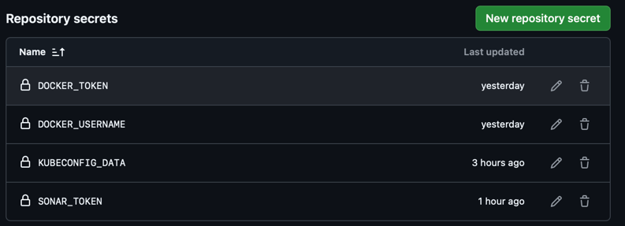
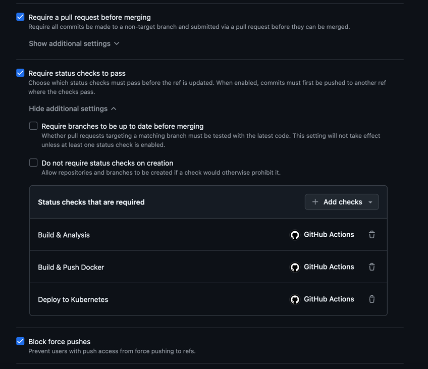
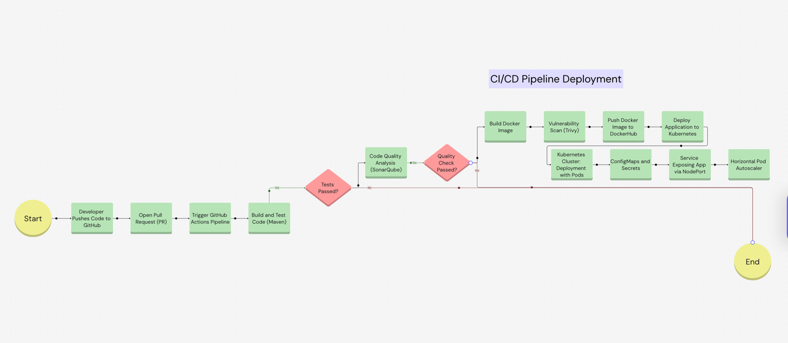
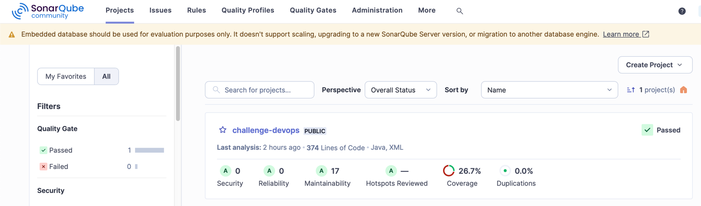
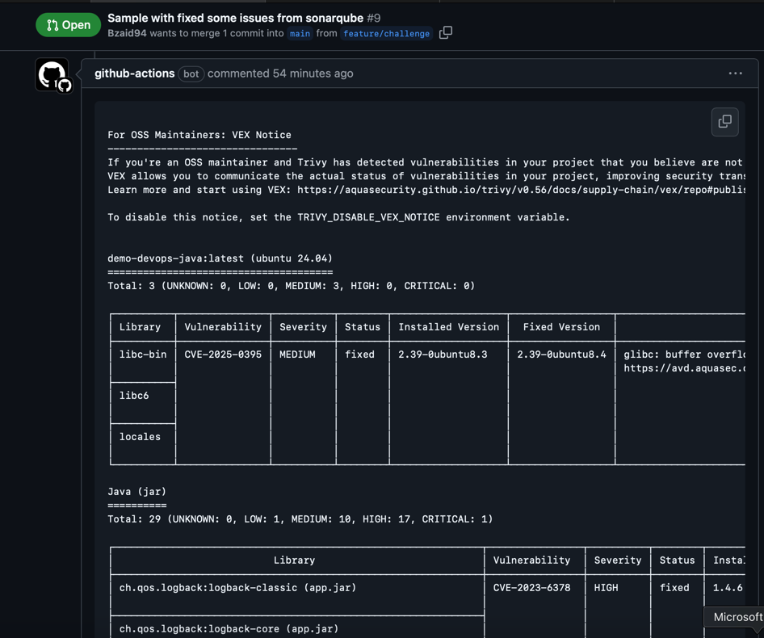
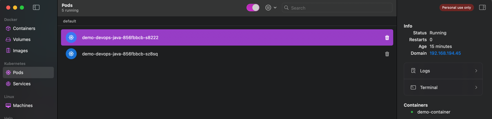
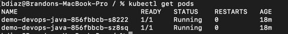
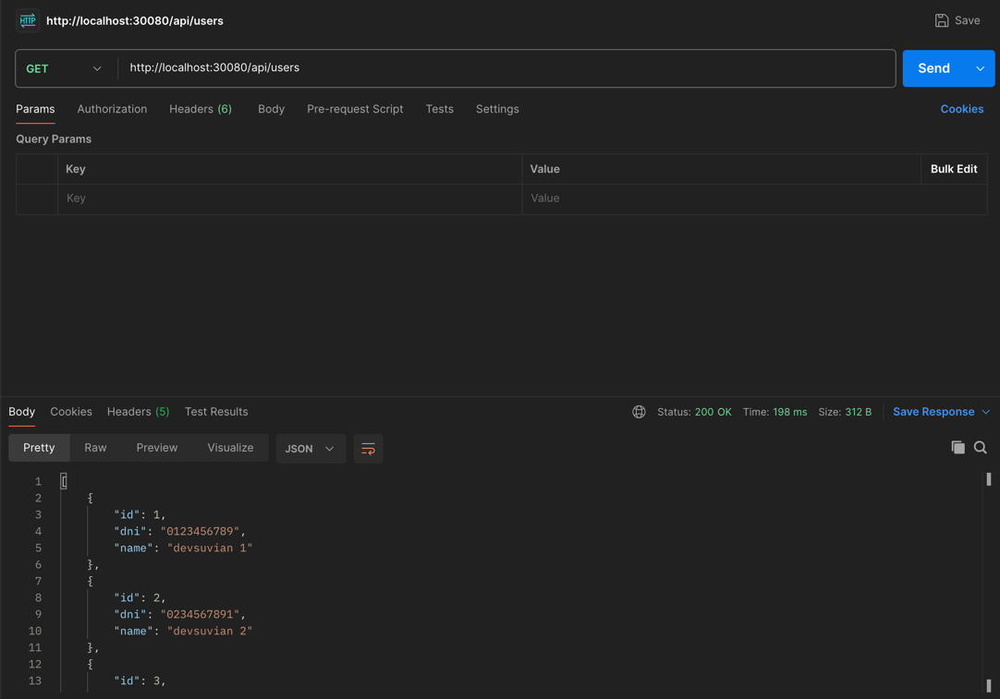
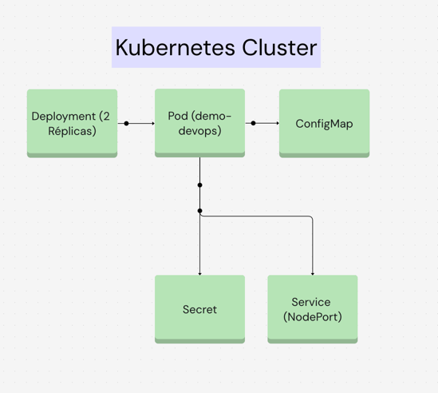

# Descripción General
Este proyecto implementa un pipeline de integración y despliegue continuo (CI/CD) para una aplicación basada en Java utilizando Spring Boot. La solución incluye dockerización de la aplicación, análisis de calidad de código, y despliegue automatizado en un clúster Kubernetes.

# Caso de uso
1. Si se finaliza el desarrollo de un requerimiento, el Desarrollador puede crear un PR de la rama en la que está trabajando hacia main
2. El PR debe pasar por los checks obligatorios y ademas no tener vulnerabilidades.
3. Debe existir la aprobación del Code Review para garantizar las buenas practicas
4. Una vez pasados los checks el servicio se Despliega de manera automatica
5. Puede configurarse los ambientes para ello, agregando (si se desea) un paso mas para un paso a producción

## Características Principales
1. **Dockerización de la Aplicación**
    - Se creó un archivo `Dockerfile` en el proyecto para construir una imagen Docker.
2. **Pipeline CI/CD con GitHub Actions**
* Se configuró un workflow en GitHub Actions que automatiza los siguientes pasos:
    1. **Build y Análisis del Código**: Compilación del proyecto y ejecución de pruebas unitarias con Maven, además del análisis del código con SonarQube.
    2. **Build y Push de Imagen Docker**: Construcción de la imagen Docker, escaneo de vulnerabilidades con Trivy, y subida de la imagen a Docker Hub.
    3. **Despliegue en Kubernetes**: Desplegar la aplicación en un clúster Kubernetes local.
3. **Configuración de Repositorio**
    - Se agregaron las variables y secrets al repositorio para el llamado dentro del workflow y asi garantizar que las credenciales estan seguras
   
    - Se agregaron reglas de protección a la rama `main`:
        - Solo se permite el merge mediante pull requests.
        - Se establecieron **status checks** obligatorios para garantizar que el pipeline pase antes del merge.
      

## Estructura del Pipeline


Para la correcta comunicacion con nuestras herramientas locales (Sonarqube, Kubernetes), se creo un runner local y se asigno a cada job como self-hosted.
El pipeline consta de tres etapas principales

### 1. Build & Analysis
- **Acciones realizadas:**
    - Configura la version de Java
    - Compilación del proyecto con Maven.
    - Ejecución de pruebas unitarias con maven verify.
    - Análisis de calidad del código con SonarCloud y cobertura de código con Jacoco.
      - Para ello se agrego el plugin al POM.xml, para generar el reporte y se asigna al analisis de Sonarqube para conocer la cobertura.

```yaml
      - name: Analysis with SonarCloud
        run: |
          mvn sonar:sonar \
          -Dsonar.projectKey=${{ env.SONAR_PROJECT_KEY }} \
          -Dsonar.host.url=${{ env.SONAR_HOST }} \
          -Dsonar.token=${{ secrets.SONAR_TOKEN }} \
          -Dsonar.coverage.jacoco.xmlReportPaths=target/site/jacoco/jacoco.xml
```


### 2. Build & Push Docker
- **Acciones realizadas:**
    - Construcción de la imagen Docker.
    - Escaneo de vulnerabilidades con Trivy.
      - Para este punto, se omitio (para fines practicos) que se interrumpa el workflow si encuentra vulnerabilidades. En su lugar, se agregó un paso para que en el comment del PR activo, se agregue los resultados del analisis de vulnerabilidades, esto da lugar a que se puedan crear reglas para restringir los despliegues en los ambientes.
      ```yaml
      - name: Comment on Pull Request
        if: always()
        uses: actions/github-script@v7
        with:
          script: |
            const fs = require('fs');
            const report = fs.readFileSync('trivy-report.txt', 'utf8');
              
            const body = `
            \`\`\`
            ${report}
            \`\`\`
            `;
      
            await github.rest.issues.createComment({
              issue_number: context.issue.number,
              owner: context.repo.owner,
              repo: context.repo.repo,
              body: body
            })
        ```
      
    - Subida de la imagen al repositorio Docker Hub.
      - Para fines practicos se hizo el push hacia Docker hub para luego se llamado por despliegue en Kubernetes

### 3. Deploy to Kubernetes
- **Acciones realizadas:**
    - Despliegue de la aplicación en un clúster Kubernetes local.
      - Se agregaron los archivos; ConfigMap, Secret, Deployment, Service, y HPA.
      

      

# Recursos de Kubernetes
Se crearon los siguientes archivos de configuración:



### ConfigMap
- Variables de entorno no sensibles que usa la applicación

### Secret
- Variables de entorno sensibles como credenciales de la DB (para este ejemplo se colocaron en base64)

### Deployment
- Especificar la imagen Docker (la obtiene de Dockerhub):  [Docker Hub / Bzaid94](https://hub.docker.com/repository/docker/bzaid94/demo-devops-java/general)
- Define la cantidad de replicas
- Configuracion del estado de salud. Utiliza actuator que fue configurado en las dependencias del proyecto.
- 

### Horizontal Pod Autoscaler (HPA)
- Asegura que la aplicación pueda escalar de forma automatica 
- En este ejemplo se dejo configurado que pueda escalar hasta 4 replicas, si el consumo de CPU de las actuales supera el 70%

### Service
- Configurar un NodePort para exponer el puerto de manera estatica

## Requisitos para Ejecutar Localmente
- Clonar el repositorio
- Configurar un runner en GitHub self-hosted (en caso no se cuente con recursos en la nube)
- Kubernetes con Minikube o Docker Desktop.
- Configurar las variables de entorno necesarias:
    - `SONAR_HOST`
    - `SONAR_TOKEN`
    - `DOCKER_USERNAME`
    - `DOCKER_TOKEN`
    - `KUBECONFIG_DATA`


